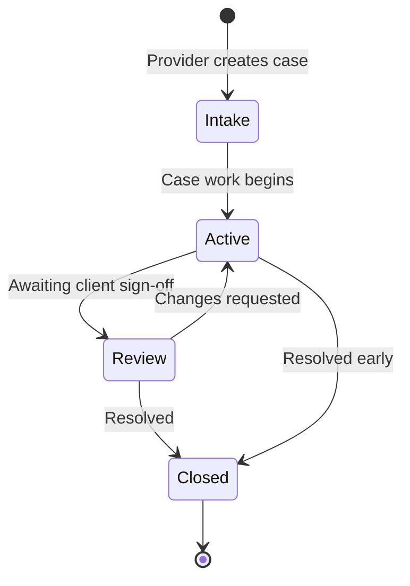
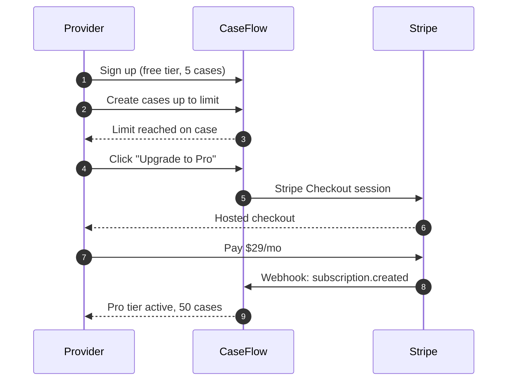
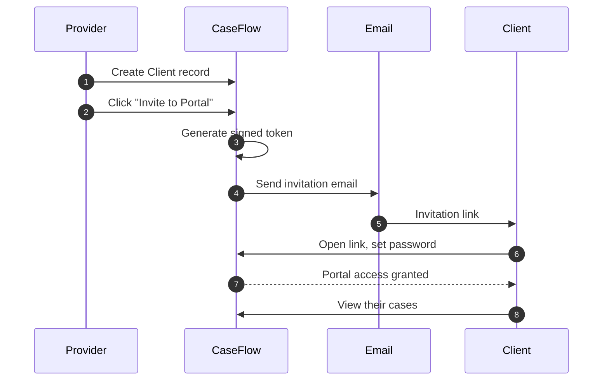
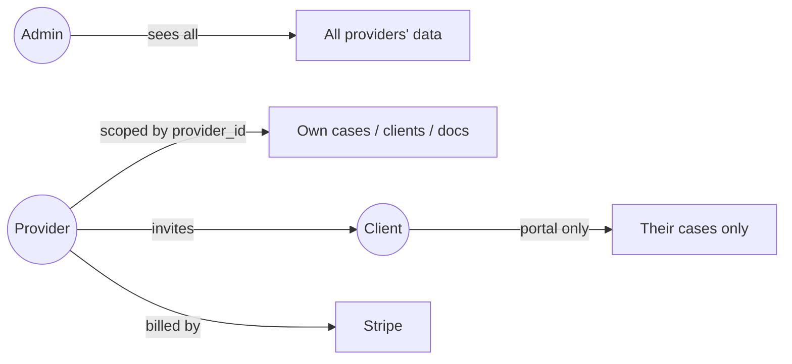
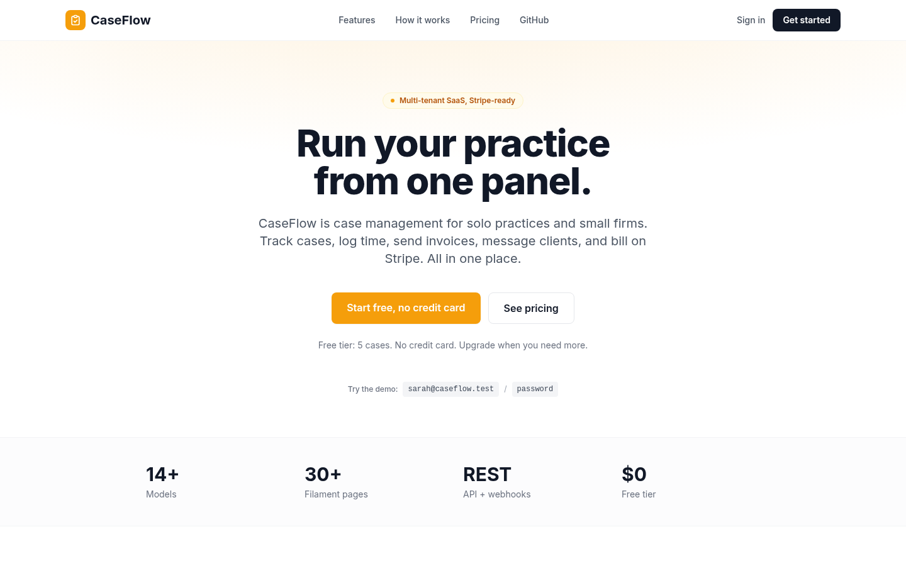
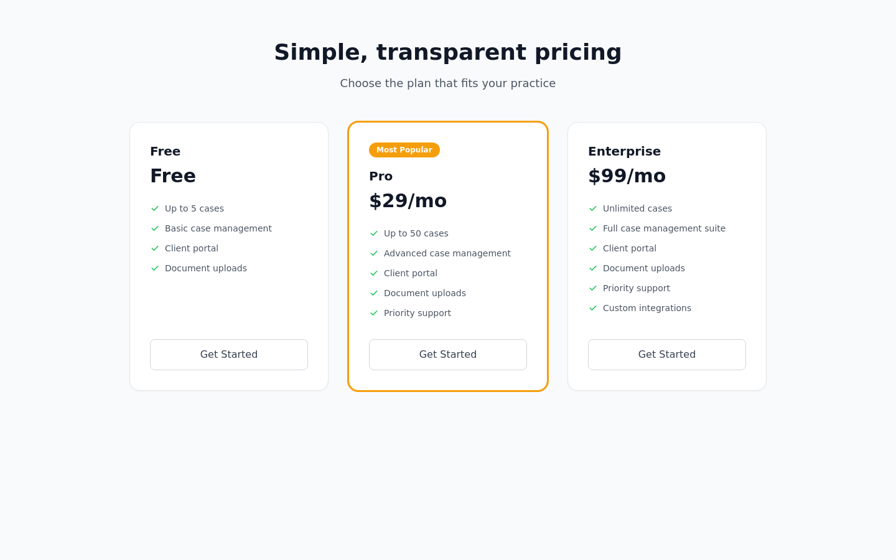
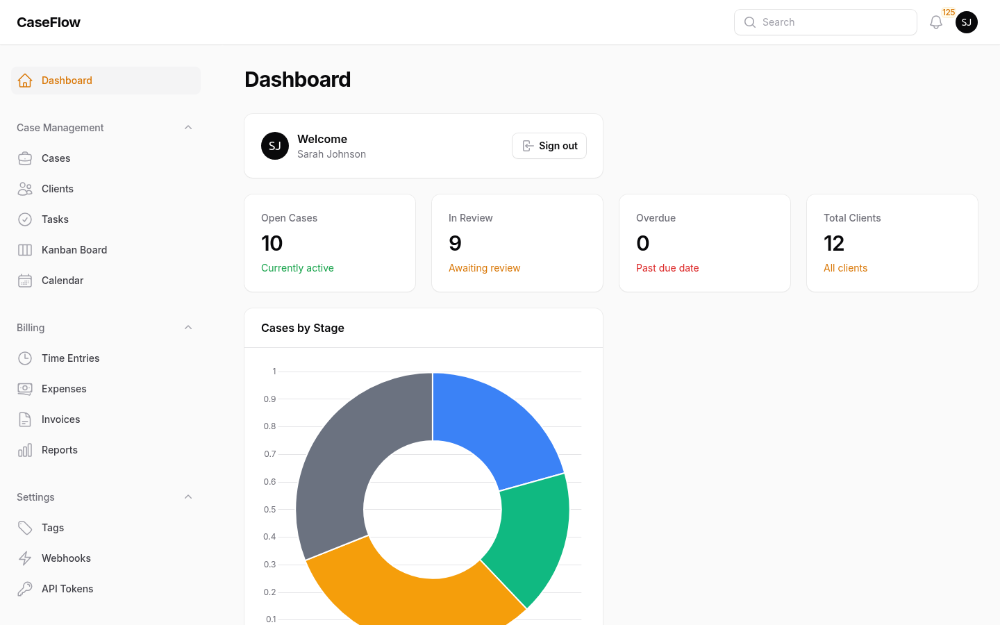
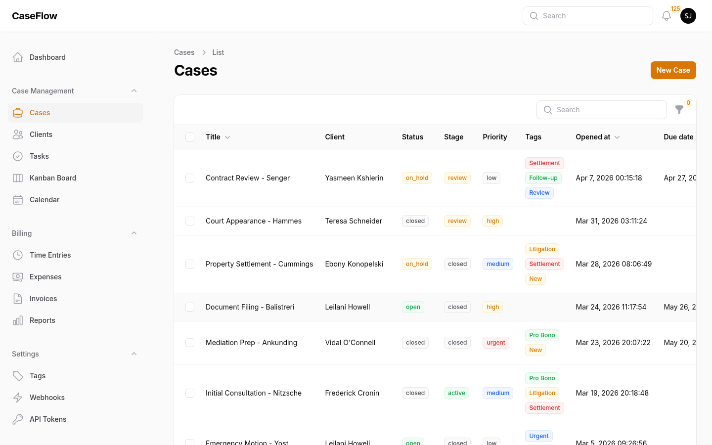
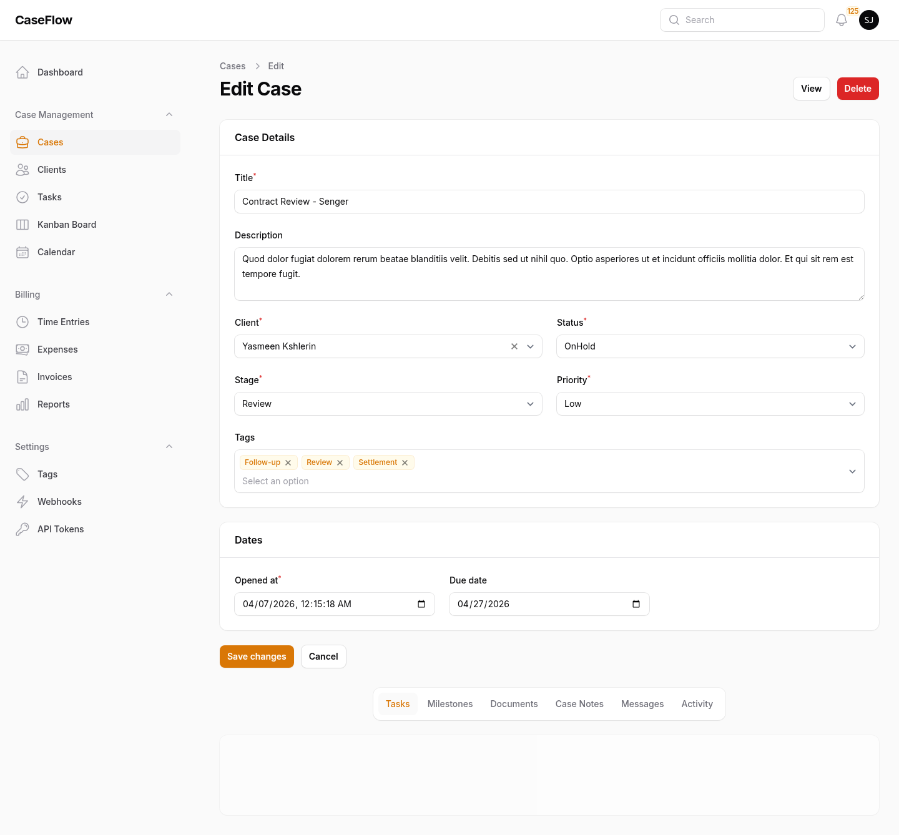

# CaseFlow

**Multi-tenant case management SaaS for service providers.** Run your practice from one admin panel. Invite clients into a separate portal. Bill on Stripe from day one.

Built for law firms, consultants, coaches, and anyone who manages cases for clients. No tenant URL prefixes, no plugin sprawl, no second framework just to render a client view.

---

## Key features

### Provider — run your practice from one panel

- **Filament admin** with dashboard widgets, recent activity, and case statistics
- **Cases** with stages (Intake → Active → Review → Closed) and statuses (Open, On Hold, Closed)
- **Clients** with full CRM details, notes, and linked cases
- **Milestones, documents, and messages** as relation managers on each case
- **Multi-tenant by default** — every provider sees only their own data, automatically
- **Plan-aware** — case creation is blocked when the provider hits their tier limit

### Client — a portal that respects them

- **Separate Livewire portal** at `/portal`, not a second Filament panel
- **Invitation-based onboarding** — providers send a tokenized link, clients set their password
- **View case status, milestones, and documents** without ever touching the admin panel
- **Upload documents** to their cases
- **Chat-style messaging** with their provider, threaded per case
- **Invoices** synced from Stripe

### Billing — Stripe from day one

- **Three tiers:** Free (5 cases), Pro ($29/mo, 50 cases), Enterprise ($99/mo, unlimited)
- **Stripe Checkout** for upgrades
- **Customer billing portal** for invoices, payment methods, and cancellations
- **Plan enforcement** at the model layer, not just the UI
- **Laravel Cashier** drives the whole flow — webhooks, subscriptions, the works

### Multi-tenancy that disappears

- **Global scope on `provider_id`** auto-filters every query for the authenticated provider
- **No URL prefix** — `/admin/cases` works whether you're Sarah or Michael, you each see your own
- **Admins bypass the scope** to support any provider's account
- **One source of truth** in `ScopedByProvider` trait + `ProviderScope` class

---

## How it works

### Case lifecycle



### Provider onboarding and billing



### Client invitation flow



### Who sees what



---

## Screenshots

### Public landing



### Pricing — three tiers, Stripe-backed

Free, Pro, and Enterprise. Plan limits enforced at the model layer, not just hidden in the UI.



### Provider dashboard

The Filament admin opens to a stat-heavy dashboard: total cases, open cases, this month's revenue, recent activity.



### Cases list

Every provider sees only their own cases. Sortable, searchable, filterable by stage and status.



### Case detail with milestones, documents, and messages

Relation managers on a single page: track milestones, attach documents, message the client, all without leaving the case.



### Clients list

Full CRM-style client records. Linked back to cases. Provider-scoped.


### Client portal — the client's view

Clients log in to a separate Livewire portal. They see their own cases, can upload documents, and message their provider. They never touch the admin panel.


> Screenshots are captured reproducibly by [`scripts/screenshots.mjs`](scripts/screenshots.mjs) — it drives headless Chrome through real provider and client flows against a freshly seeded database.

---

## Roadmap

- [x] **Phase 1** — Multi-tenant Filament admin with cases, clients, milestones, documents, messages
- [x] **Phase 2** — Livewire client portal with invitation-based onboarding
- [x] **Phase 3** — Stripe Cashier billing with three tiers and plan enforcement
- [x] **Phase 4** — Reproducible screenshot pipeline
- [ ] **Phase 5** — Email notifications (case updates, new messages, milestone changes)
- [ ] **Phase 6** — File previews in the portal (PDF, image inline)
- [ ] **Phase 7** — Activity log per case (who did what, when)
- [ ] **Phase 8** — Custom branding per provider (logo, colors)
- [ ] **Phase 9** — Public client intake forms with Stripe-paid consultations
- [ ] **Phase 10** — Webhook-out events for Zapier / Make integrations

---

## Tech stack

<details>
<summary>Click to expand</summary>

| Layer | Choice |
|---|---|
| Backend | Laravel 12, PHP 8.2 |
| Admin panel | Filament 3 |
| Client portal | Livewire 3, Tailwind CSS |
| Database | PostgreSQL 16 |
| Payments | Laravel Cashier (Stripe) |
| Auth | Laravel session + role enum (admin / provider / client) |
| Containerization | Docker + Docker Compose |

No second framework for the client view. No tenancy plugin. No multi-database split. One Laravel app, one PostgreSQL schema, one mental model.

</details>

---

## Architecture decisions

<details>
<summary>Click to expand</summary>

### Multi-tenancy via global scope, not subdomain or schema split

A `provider_id` column on every tenant-scoped model (Client, CaseRecord, Document, Message), plus a global `ProviderScope` that auto-filters queries to the authenticated provider. Admins bypass the scope.

This is invisible at the routing layer — `/admin/cases` works for any provider, they just see different data. No subdomain DNS to manage, no `ProviderMiddleware` to forget on a route, no per-tenant database to back up.

See [app/Models/Scopes/ProviderScope.php](app/Models/Scopes/ProviderScope.php) and [app/Models/Concerns/ScopedByProvider.php](app/Models/Concerns/ScopedByProvider.php).

### `CaseRecord` not `Case`

`Case` is a PHP reserved word (`switch / case`). The model is `CaseRecord` and the table is `case_records`. Filament displays it as "Case" in the UI via `$modelLabel = 'Case'`.

### Single User table with role enum

Admins, providers, and clients share one `users` table with a `role` column (`admin / provider / client`). A separate `Client` model holds CRM-style provider-specific data and links back to a `User` via nullable `user_id` (set when the client accepts their portal invite).

This keeps auth simple — one login form, one password reset flow — while letting the Client model carry data that has nothing to do with auth.

### Livewire portal, not a second Filament panel

The client portal is plain Livewire 3 with Tailwind. Filament's second-panel feature would have worked, but a portal for clients is fundamentally not the same product as an admin for providers — different navigation, different defaults, different polish bar. Livewire gives full control over UX without inheriting admin-panel assumptions.

### Plan enforcement at the model layer

`User::canCreateCase()` checks the provider's current case count against their plan limit. Filament's `beforeCreate()` hook calls it. The check would still fire from a script or a tinker session — it's not a UI affordance, it's a domain rule.

</details>

---

## Running locally

<details>
<summary>Click to expand</summary>

### 1. Map `caseflow.local` to localhost

```bash
echo "127.0.0.1 caseflow.local" | sudo tee -a /etc/hosts
```

### 2. Start the Docker stack

```bash
git clone https://github.com/atifali-pm/caseflow.git
cd caseflow
cp .env.example .env
docker-compose up -d --build
```

### 3. Generate app key and seed demo data

```bash
docker exec caseflow-app php artisan key:generate
docker exec caseflow-app php artisan migrate:fresh --seed
```

### 4. Open the app

| URL | Who |
|---|---|
| http://caseflow.local:8010/ | Public landing |
| http://caseflow.local:8010/pricing | Pricing page |
| http://caseflow.local:8010/admin | Provider / admin Filament panel |
| http://caseflow.local:8010/portal/login | Client portal |

### Demo accounts (all password: `password`)

| Role | Email | Notes |
|---|---|---|
| Admin | `admin@caseflow.test` | Sees all data, bypasses provider scope |
| Provider | `sarah@caseflow.test` | 22 cases, 11 clients seeded |
| Provider | `michael@caseflow.test` | Empty, good for "blank slate" demos |
| Provider | `amy@caseflow.test` | Empty |

A demo client account is also linked to one of Sarah's seeded clients — check seeder output for the email.

### Stripe (optional, for live billing)

Add real test keys to `.env`:

```
STRIPE_KEY=pk_test_...
STRIPE_SECRET=sk_test_...
STRIPE_WEBHOOK_SECRET=whsec_...
STRIPE_PRICE_PRO=price_...
STRIPE_PRICE_ENTERPRISE=price_...
```

The pricing page works without keys — checkout and the billing portal need them.

</details>

---

## License

MIT
